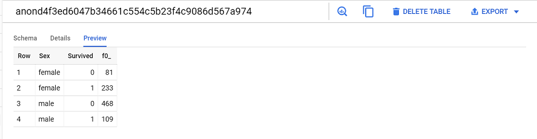
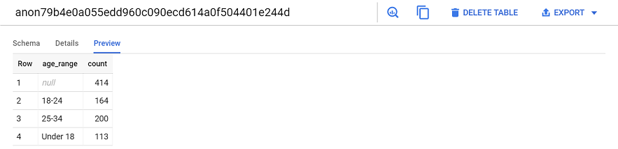
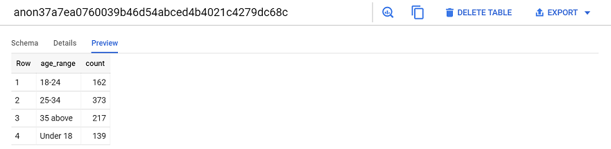
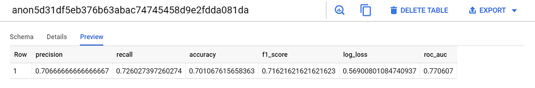

# Supervised Learning Using Bigquery

This is a Machine Learning model using GCP's [Bigquery](https://cloud.google.com/bigquery-ml/docs/bigqueryml-intro).Here I have tried to perform Supervised Machine learning on [Titanic dataset](https://www.kaggle.com/c/titanic) from [Kaggle](https://www.kaggle.com/). Supervised Learning on GCP could be divided into five simple steps:

1. **Data Exploration**
2. **Data Wrangling**
3. **Model Creation**
4. **Model Evaluation**
5. **Model Implementation**


## Motivation
For the last one year, I have been part of a great learning curve wherein I have upskilled myself to move into a Machine Learning and Cloud Computing. This project was practice project for all the learnings I have had. This is first of the many more to come. 
 

## Database used

<b>Built with</b>
- [Bigquery](https://cloud.google.com/bigquery-ml/docs/bigqueryml-intro)


## Code Example

```bash
    # clone this repo, removing the '-' to allow python imports:
    git clone https://github.com/adityasolanki205/Machine-Learning-On-Google-Bigquery.git
```

## Installation

Below are the steps to setup the enviroment and run the codes:

1. **Data Exploration**: First the data exploration has to be done. Download the dataset from [Titanic dataset](https://www.kaggle.com/c/titanic). Steps to upload the data and its exploration are given below.
    
    a. Create a Google Cloud Bucket.
    
    b. Upload the Train and test CSV files in that Bucket
    
    c. Goto the Bisquery using the Navigation Menu on the Top Left
    
    d. Create a Dataset 
    
    e. Create a table using Google Cloud Storage and auto detecting the Schema
    
    f. Select the correct Csv file
    
    g. Use Simple SQL queries, try to find important points and relevant data in the dataset. 
       It will be used while data wrangling. For eg. 
       
```sql
    # Here we are selecting Survived Passengers grouped by their sex
    Select 
        Sex , 
        Survived,
        count(*)
    FROM `daring-span-249015.titanic_dataset.Train`
    Group by  
        Survived , 
        Sex
    order by 
        1 , 
        2;
```


2. **Data Wrangling**: After exploration we will try to clean, structure and enrich the data so that it can be make more sense to the Algorithm.


```sql
    # Here We are trying to select passengers according to their age group. 
    select 
        case
            when age <18 then 'Under 18'
            when age between 18 and 24 then '18-24'
            when age between 25 and 34 then '25-34'
            when age > 34 then '35 above'
        END as age_range, 
        Count(*) as count
    from `daring-span-249015.titanic_dataset.Train`
    group by age_range
    order by age_range;
```


```sql
    # So we will update the null Values with Mean of the complete column
    Update `daring-span-249015.titanic_dataset.Train`
    set age = (SELECT avg(age)
                from `daring-span-249015.titanic_dataset.Train`
                where age IS NOT NULL
                )
    where age IS NULL;
```


3. **Model Creation**: After data wrangling we will try to create a Supervised [Logistic Regression model](https://cloud.google.com/bigquery-ml/docs/reference/standard-sql/bigqueryml-syntax-create#model_type).  

```sql
    # This query below will create a logistic regression model for our input data
    
    CREATE OR REPLACE MODEL `daring-span-249015.titanic_dataset.classification_model`
    OPTIONS
    (
    model_type='logistic_reg',
    input_label_cols=['Survived']
    )
    AS
        select
            Sex ,
            Pclass,
            case
                when age between 0 and 18   then 1
                when age between 18 and 24  then 2
                when age > 24 and age <= 34 then 3
                when age > 34               then 4
            END as age_range,
            case
                when Embarked ='C' then 1
                when Embarked ='Q'  then 2
                when Embarked ='S' then 3
                when Embarked IS NULL then 4
            END AS point_of_embarkment,
            SibSp,
            Parch,
            Survived
        from `daring-span-249015.titanic_dataset.Train`
        group by 
                Pclass,
                Sex ,
                Embarked, 
                age_range, 
                SibSp, 
                parch, 
                Survived;
```

4. **Model Evaluation**:  After model creation we will evaluate it on the input data.

```sql
    # Here we will use the ML.EVALUATE object to measure our model
    
    SELECT * FROM
    ML.EVALUATE 
     (MODEL `daring-span-249015.titanic_dataset.classification_model`, 
     (select
        Sex ,
        Pclass,
        case
         when age between 0 and 18   then 1
         when age between 18 and 24  then 2
         when age > 24 and age <= 34 then 3
         when age > 34               then 4
        END as age_range,
        case
         when Embarked ='C' then 1
         when Embarked ='Q'  then 2
         when Embarked ='S' then 3
         when Embarked IS NULL then 4
        END AS point_of_embarkment,
        SibSp,
        Parch,
        Survived
       from `daring-span-249015.titanic_dataset.Train`
       group by 
          Pclass,
          Sex ,
          Embarked, 
          age_range, 
          SibSp, 
          parch, 
          Survived)
     );
```


5. **Model Implementation**: Atlast we will use the model to predict the values over our testing dataset.

```sql
    # To predict we will use the ML.PREDICT object
    
    SELECT * FROM
    ML.PREDICT(MODEL `daring-span-249015.titanic_dataset.classification_model`, 
    (select
        Sex ,
        Pclass ,
        case
             when age between 0 and 18   then 1
             when age between 18 and 24  then 2
             when age > 24 and age <= 34 then 3
             when age > 34               then 4
        END as age_range,
        case
             when Embarked ='C' then 1
             when Embarked ='Q'  then 2
             when Embarked ='S' then 3
             when Embarked IS NULL then 4
        END AS point_of_embarkment,
        SibSp,
        Parch
       from `daring-span-249015.titanic_dataset.Test`
       group by 
        Pclass,
        Sex ,
        Embarked, 
        age_range, 
        SibSp, 
        parch)
    )
```
[](Images/predict.png)
    
## How to use?
To run this machine learning model, you will have to run all the SQL queries present [here](https://github.com/adityasolanki205/Machine-Learning-On-Google-Bigquery/blob/master/Supervised%20Learning/Titanic%20Dataset%20Bigquery.ipynb). This model has an accuracy of a little over 70 percent. 

## Credits
1. [Google Bigquery Documentation](https://cloud.google.com/bigquery/docs)
2. [Codelabs](https://codelabs.developers.google.com/codelabs/end-to-end-ml/index.html?index=..%2F..index#1)
